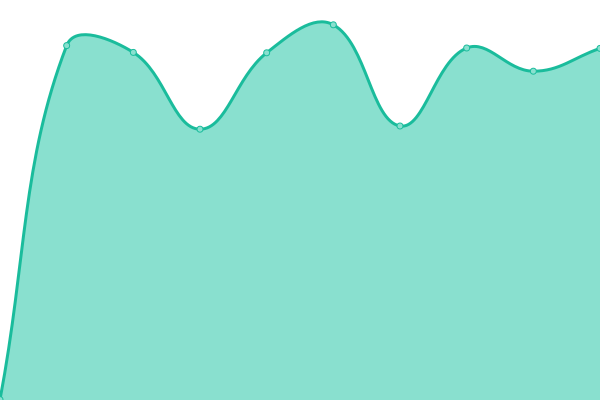

# [📈 Live Status](https://adroitcreations-dev.github.io/upptime): <!--live status--> **🟩 All systems operational**

This repository contains the open-source uptime monitor and status page for [adroitcreations-dev](https://adroitcreations-dev.github.io/upptime), powered by [Upptime](https://github.com/upptime/upptime).

With [Upptime](https://upptime.js.org), you can get your own unlimited and free uptime monitor and status page, powered entirely by a GitHub repository. We use [Issues](https://github.com/adroitcreations-dev/upptime/issues) as incident reports, [Actions](https://github.com/adroitcreations-dev/upptime/actions) as uptime monitors, and [Pages](https://adroitcreations-dev.github.io/upptime) for the status page.

<!--start: status pages-->
<!-- This summary is generated by Upptime (https://github.com/upptime/upptime) -->
<!-- Do not edit this manually, your changes will be overwritten -->
<!-- prettier-ignore -->
| URL | Status | History | Response Time | Uptime |
| --- | ------ | ------- | ------------- | ------ |
|  [Yorke Peninsula Council website](https://yorke.sa.gov.au/) | 🟩 Up | [yorke-peninsula-council-website.yml](https://github.com/adroitcreations-dev/upptime/commits/HEAD/history/yorke-peninsula-council-website.yml) | 

 1955ms
     
 | 

<a href="https://adroitcreations-dev.github.io/upptime/history/yorke-peninsula-council-website">99.71%</a>
    

|  [Yorke elementORG](https://yorke.elementorg.com) | 🟩 Up | [yorke-element-org.yml](https://github.com/adroitcreations-dev/upptime/commits/HEAD/history/yorke-element-org.yml) | 

 2915ms
     
 | 

<a href="https://adroitcreations-dev.github.io/upptime/history/yorke-element-org">100.00%</a>
    

|  [Status page - elementORG](https://status.elementorg.com) | 🟩 Up | [status-page-element-org.yml](https://github.com/adroitcreations-dev/upptime/commits/HEAD/history/status-page-element-org.yml) | 

 818ms
     
 | 

<a href="https://adroitcreations-dev.github.io/upptime/history/status-page-element-org">100.00%</a>
    

|  [NGSC elementORG](https://ngsc.elementorg.com) | 🟩 Up | [ngsc-element-org.yml](https://github.com/adroitcreations-dev/upptime/commits/HEAD/history/ngsc-element-org.yml) | 

 1551ms
     
 | 

<a href="https://adroitcreations-dev.github.io/upptime/history/ngsc-element-org">100.00%</a>
    

|  [Leeton elementORG](https://leeton.elementorg.com/) | 🟩 Up | [leeton-element-org.yml](https://github.com/adroitcreations-dev/upptime/commits/HEAD/history/leeton-element-org.yml) | 

 1848ms
     
 | 

<a href="https://adroitcreations-dev.github.io/upptime/history/leeton-element-org">100.00%</a>
    

|  [YPC elementORG](https://ypc.elementorg.com/) | 🟩 Up | [ypc-element-org.yml](https://github.com/adroitcreations-dev/upptime/commits/HEAD/history/ypc-element-org.yml) | 

 1564ms
     
 | 

<a href="https://adroitcreations-dev.github.io/upptime/history/ypc-element-org">100.00%</a>
    

|  [Adroit Creations elementORG](https://adroitcreations.elementorg.com/) | 🟩 Up | [adroit-creations-element-org.yml](https://github.com/adroitcreations-dev/upptime/commits/HEAD/history/adroit-creations-element-org.yml) | 

 3280ms
     
 | 

<a href="https://adroitcreations-dev.github.io/upptime/history/adroit-creations-element-org">99.70%</a>
    

|  [Mt Barker elementORG](https://mountbarker.elementorg.com/) | 🟩 Up | [mt-barker-element-org.yml](https://github.com/adroitcreations-dev/upptime/commits/HEAD/history/mt-barker-element-org.yml) | 

 1114ms
     
 | 

<a href="https://adroitcreations-dev.github.io/upptime/history/mt-barker-element-org">100.00%</a>
    

|  [Demo Forms wp-cron for testing AD sync](https://demo-forms.elementorg.com/wp-cron.php) | 🟩 Up | [demo-forms-wp-cron-for-testing-ad-sync.yml](https://github.com/adroitcreations-dev/upptime/commits/HEAD/history/demo-forms-wp-cron-for-testing-ad-sync.yml) | 

 691ms
     
 | 

<a href="https://adroitcreations-dev.github.io/upptime/history/demo-forms-wp-cron-for-testing-ad-sync">99.70%</a>
    

|  [SA Fires](https://sa.fires.elementorg.com/) | 🟩 Up | [sa-fires.yml](https://github.com/adroitcreations-dev/upptime/commits/HEAD/history/sa-fires.yml) | 

 2642ms
     
 | 

<a href="https://adroitcreations-dev.github.io/upptime/history/sa-fires">100.00%</a>
    

|  [Online burn-offs](https://sa.burnoffs.elementorg.com/) | 🟩 Up | [online-burn-offs.yml](https://github.com/adroitcreations-dev/upptime/commits/HEAD/history/online-burn-offs.yml) | 

 963ms
     
 | 

<a href="https://adroitcreations-dev.github.io/upptime/history/online-burn-offs">100.00%</a>
    

|  [elementTIME - Yorke validate](https://yorke.elementtime.com/validate) | 🟩 Up | [element-time-yorke-validate.yml](https://github.com/adroitcreations-dev/upptime/commits/HEAD/history/element-time-yorke-validate.yml) | 

 865ms
     
 | 

<a href="https://adroitcreations-dev.github.io/upptime/history/element-time-yorke-validate">100.00%</a>
    

|  [elementSTAFF - yorke](https://yorke.elementstaff.com) | 🟩 Up | [element-staff-yorke.yml](https://github.com/adroitcreations-dev/upptime/commits/HEAD/history/element-staff-yorke.yml) | 

 825ms
     
 | 

<a href="https://adroitcreations-dev.github.io/upptime/history/element-staff-yorke">100.00%</a>
    

|  [elementSTAFF - Test Yorke API health](https://testyorke.elementstaff.com/api/health) | 🟩 Up | [element-staff-test-yorke-api-health.yml](https://github.com/adroitcreations-dev/upptime/commits/HEAD/history/element-staff-test-yorke-api-health.yml) | 

 805ms
     
 | 

<a href="https://adroitcreations-dev.github.io/upptime/history/element-staff-test-yorke-api-health">100.00%</a>
    

|  [elementSTAFF website](https://www.elementstaff.com) | 🟩 Up | [element-staff-website.yml](https://github.com/adroitcreations-dev/upptime/commits/HEAD/history/element-staff-website.yml) | 

 815ms
     
 | 

<a href="https://adroitcreations-dev.github.io/upptime/history/element-staff-website">99.70%</a>
    

|  [elementORG website](https://www.elementorg.com) | 🟩 Up | [element-org-website.yml](https://github.com/adroitcreations-dev/upptime/commits/HEAD/history/element-org-website.yml) | 

 814ms
     
 | 

<a href="https://adroitcreations-dev.github.io/upptime/history/element-org-website">99.70%</a>
    

|  [elementTIME website](https://www.elementtime.com/) | 🟩 Up | [element-time-website.yml](https://github.com/adroitcreations-dev/upptime/commits/HEAD/history/element-time-website.yml) | 

 1064ms
     
 | 

<a href="https://adroitcreations-dev.github.io/upptime/history/element-time-website">99.70%</a>
    

|  [Adroit Creations website](https://www.adroitcreations.com) | 🟩 Up | [adroit-creations-website.yml](https://github.com/adroitcreations-dev/upptime/commits/HEAD/history/adroit-creations-website.yml) | 

 2621ms
     
 | 

<a href="https://adroitcreations-dev.github.io/upptime/history/adroit-creations-website">99.70%</a>
    

|  [The Creation Room](https://thecreationroom.com/) | 🟩 Up | [the-creation-room.yml](https://github.com/adroitcreations-dev/upptime/commits/HEAD/history/the-creation-room.yml) | 

 734ms
     
 | 

<a href="https://adroitcreations-dev.github.io/upptime/history/the-creation-room">99.70%</a>
    

<!--end: status pages-->

[**Visit our status website →**](https://adroitcreations-dev.github.io/upptime)

## 📄 License

- Powered by: [Upptime](https://github.com/upptime/upptime)
- Code: [MIT](./LICENSE) © [adroitcreations-dev](https://adroitcreations-dev.github.io/upptime)
- Data in the `./history` directory: [Open Database License](https://opendatacommons.org/licenses/odbl/1-0/)
