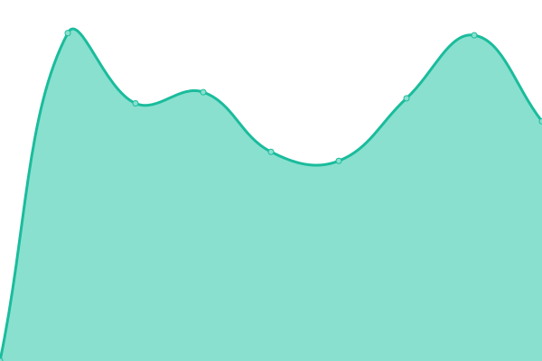

# [📈 Live Status](https://adroitcreations-dev.github.io/upptime): <!--live status--> **🟩 All systems operational**

This repository contains the open-source uptime monitor and status page for [adroitcreations-dev](https://adroitcreations-dev.github.io/upptime), powered by [Upptime](https://github.com/upptime/upptime).

With [Upptime](https://upptime.js.org), you can get your own unlimited and free uptime monitor and status page, powered entirely by a GitHub repository. We use [Issues](https://github.com/adroitcreations-dev/upptime/issues) as incident reports, [Actions](https://github.com/adroitcreations-dev/upptime/actions) as uptime monitors, and [Pages](https://adroitcreations-dev.github.io/upptime) for the status page.

<!--start: status pages-->
<!-- This summary is generated by Upptime (https://github.com/upptime/upptime) -->
<!-- Do not edit this manually, your changes will be overwritten -->
<!-- prettier-ignore -->
| URL | Status | History | Response Time | Uptime |
| --- | ------ | ------- | ------------- | ------ |
|  [Yorke Peninsula Council](https://yorke.sa.gov.au/) | 🟩 Up | [yorke-peninsula-council.yml](https://github.com/adroitcreations-dev/upptime/commits/HEAD/history/yorke-peninsula-council.yml) | 

 2430ms
     
 | 

<a href="https://adroitcreations-dev.github.io/upptime/history/yorke-peninsula-council">100.00%</a>
    

|  [Yorke elementOrg](https://yorke.elementorg.com) | 🟩 Up | [yorke-element-org.yml](https://github.com/adroitcreations-dev/upptime/commits/HEAD/history/yorke-element-org.yml) | 

 3945ms
     
 | 

<a href="https://adroitcreations-dev.github.io/upptime/history/yorke-element-org">100.00%</a>
    

|  [The Creation Room](https://thecreationroom.com/) | 🟩 Up | [the-creation-room.yml](https://github.com/adroitcreations-dev/upptime/commits/HEAD/history/the-creation-room.yml) | 

 742ms
     
 | 

<a href="https://adroitcreations-dev.github.io/upptime/history/the-creation-room">100.00%</a>
    

|  [Status page - elementOrg](https://status.elementorg.com) | 🟩 Up | [status-page-element-org.yml](https://github.com/adroitcreations-dev/upptime/commits/HEAD/history/status-page-element-org.yml) | 

 884ms
     
 | 

<a href="https://adroitcreations-dev.github.io/upptime/history/status-page-element-org">100.00%</a>
    

|  [NGSC elementORG](https://ngsc.elementorg.com) | 🟩 Up | [ngsc-element-org.yml](https://github.com/adroitcreations-dev/upptime/commits/HEAD/history/ngsc-element-org.yml) | 

 1960ms
     
 | 

<a href="https://adroitcreations-dev.github.io/upptime/history/ngsc-element-org">100.00%</a>
    

|  [Leeton elementORG](https://leeton.elementorg.com/) | 🟩 Up | [leeton-element-org.yml](https://github.com/adroitcreations-dev/upptime/commits/HEAD/history/leeton-element-org.yml) | 

 2060ms
     
 | 

<a href="https://adroitcreations-dev.github.io/upptime/history/leeton-element-org">99.20%</a>
    

|  [Mt Barker elementORG](https://mountbarker.elementorg.com/) | 🟩 Up | [mt-barker-element-org.yml](https://github.com/adroitcreations-dev/upptime/commits/HEAD/history/mt-barker-element-org.yml) | 

 2042ms
     
 | 

<a href="https://adroitcreations-dev.github.io/upptime/history/mt-barker-element-org">100.00%</a>
    

|  [Online burnoffs](https://sa.fires.elementorg.com/) | 🟩 Up | [online-burnoffs.yml](https://github.com/adroitcreations-dev/upptime/commits/HEAD/history/online-burnoffs.yml) | 

 1410ms
     
 | 

<a href="https://adroitcreations-dev.github.io/upptime/history/online-burnoffs">100.00%</a>
    

|  [elementTime website](https://www.elementtime.com/) | 🟩 Up | [element-time-website.yml](https://github.com/adroitcreations-dev/upptime/commits/HEAD/history/element-time-website.yml) | 

 2058ms
     
 | 

<a href="https://adroitcreations-dev.github.io/upptime/history/element-time-website">100.00%</a>
    

|  [elementTime](https://yorke.elementtime.com/validate) | 🟩 Up | [element-time.yml](https://github.com/adroitcreations-dev/upptime/commits/HEAD/history/element-time.yml) | 

 1102ms
     
 | 

<a href="https://adroitcreations-dev.github.io/upptime/history/element-time">99.94%</a>
    

|  [elementStaff - york](https://yorke.elementstaff.com) | 🟩 Up | [element-staff-york.yml](https://github.com/adroitcreations-dev/upptime/commits/HEAD/history/element-staff-york.yml) | 

 898ms
     
 | 

<a href="https://adroitcreations-dev.github.io/upptime/history/element-staff-york">100.00%</a>
    

|  [elementStaff - www](http://www.elementstaff.com) | 🟩 Up | [element-staff-www.yml](https://github.com/adroitcreations-dev/upptime/commits/HEAD/history/element-staff-www.yml) | 

 2526ms
     
 | 

<a href="https://adroitcreations-dev.github.io/upptime/history/element-staff-www">100.00%</a>
    

|  [elementStaff2](https://testyorke.elementstaff.com/api/health) | 🟩 Up | [element-staff2.yml](https://github.com/adroitcreations-dev/upptime/commits/HEAD/history/element-staff2.yml) | 

 874ms
     
 | 

<a href="https://adroitcreations-dev.github.io/upptime/history/element-staff2">100.00%</a>
    

|  [elementRec](https://mountbarker.elementrec.com/apis/system/health) | 🟩 Up | [element-rec.yml](https://github.com/adroitcreations-dev/upptime/commits/HEAD/history/element-rec.yml) | 

 864ms
     
 | 

<a href="https://adroitcreations-dev.github.io/upptime/history/element-rec">100.00%</a>
    

|  [Adroit Creations website](https://www.adroitcreations.com) | 🟩 Up | [adroit-creations-website.yml](https://github.com/adroitcreations-dev/upptime/commits/HEAD/history/adroit-creations-website.yml) | 

 2741ms
     
 | 

<a href="https://adroitcreations-dev.github.io/upptime/history/adroit-creations-website">100.00%</a>
    

<!--end: status pages-->

[**Visit our status website →**](https://adroitcreations-dev.github.io/upptime)

## 📄 License

- Powered by: [Upptime](https://github.com/upptime/upptime)
- Code: [MIT](./LICENSE) © [adroitcreations-dev](https://adroitcreations-dev.github.io/upptime)
- Data in the `./history` directory: [Open Database License](https://opendatacommons.org/licenses/odbl/1-0/)
